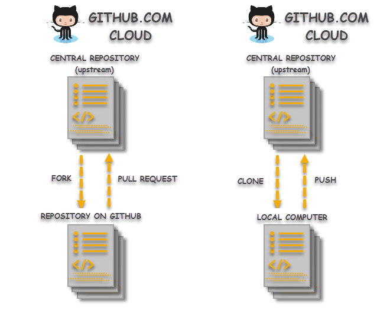

# Review: Principles of Git {#git-review}

```{r workflow2, fig.align="center", echo=FALSE, out.width= "65%", fig.cap="Source: [Allsion Horst](https://allisonhorst.com)"} 

knitr::include_graphics("./figures/GitWorkflowFig2.png")
```

## Distributed version control

Version control systems are an answer to the age-old problem of "script_final.R", "script_submitted_to_Science.R", "script_finaler.R", and "script_final_i_swear_this_is_the_last_one.R" that tend to clog up and confuse storage space on all of our computers. By tracking changes in a document (in this context, usually a coded script), version control systems allow you to keep a record of all the changes that you have made without having to re-save new documents every time. Version control systems also allow for multiple users to make changes to the same document and keep track of the who-did-what side of things. 

Version control systems store all of these changes and iterations in what's called a "repository" (also known as a repo). Think of the repository as the archive that keeps track of all of the changes that you've made to your work over time. Typically a single repository is created for each unique project, program, package, etc. In the context of scientific research, a new repository is often created to store the code needed for the analyses in an individual manuscript. This way, the repository can be referenced in a publication and readers of your work can look "under-the-hood" of the methods you used. This approach increases the transparency and accuracy of research by allowing others to reproduce your results and identify and possible mistakes. 

There are two main types of version control systems: ***centralized*** and ***distributed***. The difference lies in where the repository is stored. In a centralized version control system, there is a single computer server that hosts the repository. All the people editing to the repository must have access to that server. The downside of centralized version control is that if the server crashes or gets corrupted or decides to take a vacation, your team is in big trouble. In other words, there is little redundancy in a centralized version control system. Distributed version control systems, on the other hand, allow all the contributors create a "clone" of the repository that they store on their own computer. They can make changes to this local repository and, if they want to share those changes with others, they can "push" them up to a shared repository, often stored in an online-based repository hosting system (see [Why use Github?] below). In this way, if the cloud based repository decides to up and explode for some unknown reason (or a known reason), there are multiple backup versions on contributor's local computers that can be used to restore the repo. 
```{r vc, echo=FALSE, out.width= "80%", fig.cap="Source: [geeksforgeeks.org](https://www.geeksforgeeks.org/centralized-vs-distributed-version-control-which-one-should-we-choose/)"} 

knitr::include_graphics("./figures/CentralizedVsDistributedVC.png")
```

## Why use Git? 

Coding has become a nearly ubiquitous part of scientific research, with scientists developing increasingly complex analyses requiring extensive data wrangling and post-analysis processing and visualization steps. The development of the code needed to run these analyses often goes through many iterations during the initial development process through to the final stages of peer review. Using a distributed version control system like Git can help researchers to code collaboratively, manage and organize different versions of the same analysis, and serve as an archive of the methods used to process and analyze research data. These advantages help to support researchers in the pursuit of "[open science](https://www.cos.io/open-science)" by increasing transparency while also serving as a useful record that can be referred back to and reproduced in the future. 

## Why use GitHub?  

```{r github, echo=FALSE, out.width= "35%", out.extra='style="float:right; padding:10px"'} 

knitr::include_graphics("./figures/GitHubLogo.png")
```

GitHub is an online-based repository hosting system for Git repositories. It's worth noting that GitHub is not the only hosting system for Git repositories (see Alternatives below), however it is the most popular system and is nearly ubiquitous in the sciences. 

Additionally, GitHub has many useful features that expand upon Git and facilitate communication and collaboration amongst large groups of coders.GitHub "Issues" are one such feature that allow users to identify problems or ways to improve a set of code, to assign responsibility for the tasks needed to address them, and to keep track of the changes in the code that were made. Additionally, GitHub has features that allow for content generation, including static websites (like this one!) created using [GitHub Pages](https://pages.github.com/).  

While GitHub can require a bit of a learning curve, we believe that it is well worth the effort and, in the long run, will save researchers a lot of time on trouble-shooting, reproducing results, and sharing analysis. 

## Alternatives to GitHub

```{r github_alt, echo=FALSE, out.width= "20%", out.extra='style="float:center; padding:10px"'} 

knitr::include_graphics("./figures/GitHubAlternatives.png")
```

* [GitLab](https://about.gitlab.com/)
* [Bitbucket](https://bitbucket.org/product)

##  Git/GitHub workflow: 
This is an extremely simplified description of the components of a Git workflow. If you'd like to get more into the weeds, we highly recommend [Pro Git, Chapter 2.2](https://git-scm.com/book/en/v2/Git-Basics-Recording-Changes-to-the-Repository). 

```{r workflow, echo=FALSE, out.width= "65%", out.extra='style="float:right; padding:10px"'} 

knitr::include_graphics("./figures/GitWorkflowFig.png")
```

* ***Cloning***: Cloning is the term used for the initial creation of a local copy of a remote repository on your computer. A typical workflow is to clone the repository, modify the code, stage the changes, commit the staged changes, and then push the changes back up to the remote repository. 
* ***Staging***: After you've modified a document, staging allows you to mark the file for inclusion in a future commit. If your terminal is set to the home directory of your repository, the command ````git add <filename>```` will allow you to stage changes. 
* ***Committing***: Once a change or group of changes is staged, they can be committed to your local repository. A commit is a way to group a set of changes together under a common theme. Part of the commit is a commit message which allows you to summarize the purpose of the changes you made to the code. More on the anatomy of a good commit message later. *Note: You can pick and choose the staged files that you want to be included in each commit.* 
* ***Pushing/Pulling***: Pushing a commit is the way to incorporate changes from your local repository up to the remote repository. Think of it as pushing your changes up from your computer into the cloud. Conversely, pulling changes is taking changes that others have made to the remote repository and pulling them down from the cloud onto your local version of the repo. 

## Branching with git

Unlike cloning or forking, you can think of branches as a kind of internal copy within your repository. When working on a branch, the files in the main repository are untouched. You can stage changes, make commits, and push/pull to remote within a branch and it won't affect the main repository. This makes branches very useful when you want to make substantial changes to your repository that you're not quite sure will work. Branches are also helpful when collaborating with others. If one person needs to run the main model, but you want to test out tweaking a few things, you can work on a branch while they stay on the main branch. Then, once your confident the changes in your branch are working correctly you can merge them from your branch back into the main repo. 

## Collaborative coding: Forking and pull requests 
```{r fork, echo=FALSE, out.width= "50%", out.extra='style="float:left; padding:10px"', fig.cap="https://toolsqa.com/git/difference-between-git-clone-and-git-fork/"} 


```

When working on large open source project, it's a good idea to not let anybody have immediate edit access to the repository where that project is kept. However, you still want to allow the broader user community to participate and contribute to the project. Forking is one way to address this problem. ***Forking*** a repository allows you to create a copy of a given repository on your personal GitHub account. When you make changes to a forked repository, the original repository is not affected. However, if you have some changes that you think would help to improve the original project, you can submit a ***pull request*** to the owners of the original repository. If they like your change, then they can accept and incorporate it into the original project's repository.  
Still confused? [This webpage](https://toolsqa.com/git/difference-between-git-clone-and-git-fork/) has a really nice explanation of forking vs. cloning, along with helpful diagrams. 
