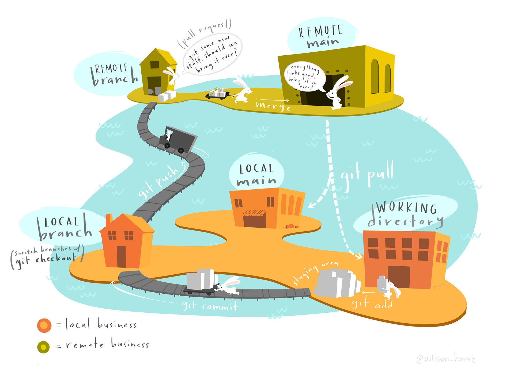
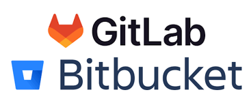
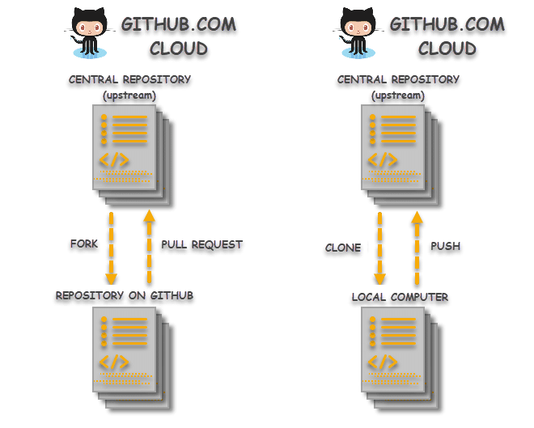

# Git and GitHub In Practice {#GitHub-in-practice}

This chapter will provide an orientation to open science code repositories, via GitHub, so you can find and use code that may be useful to you. 

We learned to organize and work through our own projects by observing how others organize theirs. The amazing thing is that you can find hundreds of excellent examples to learn from as even major companies put their code on GitHub.   


<!-- Outline

# git and GitHub in practice {#GitHub-in-practice}

-   list of git features/ commands we are assuming familiarity with in a git vs. GitHub comparison
-   foreach {commits, issues, branches, forks & pull requests, rebase}:
    -   (Kelly) define the term/feature: review of the feature, rely on previous workshops/existing doc (as written for ch2)
    -   (Kellly) point to how GitHub works with this, link to GitHub images and docs
    -   (Pat) describe important elements of this feature in practice: principles of using commits, how much code to put into a commit and why ( this helps to understand the language of OSS collaboration )
    -   (Pat) outline a typical workflow for using the feature
        -   this helps to understand the context of the culture of OSS collaboration
        -   real world example

Anatomy of a code base (15 min)** - common elements (cover licensing here in 1 sentence and a link) - our taxonomy - example code bases

**Using that code in your work** (10 minutes) - clonsider the licenceing

**Engaging with issues and PRs** ( 15 mintues ) - demo of that for a README file (Pat/Beth's repo) - demo of that with our own book

-->

## What is a code base? 

In this book we may use the terms "repository", "proejct", or "code base" interchangeably but they have slightly different meanings: 

- "Code base" is a colloquial term for any collection of related to code in one or more files that works together to perform a function, or provide an application.  

- A "repository" is an collection of code managed by git, not necessarily on an external server (i.e., GitHub or others). This could be on your laptop. The database of version history is inside the .git folder, and so that .git folder is the repository (although when people say "repository" or "repo" they are often referring to the combination of the code base and the .git version control). This is also called a "git repo".

- GitHub also calls their units "repositories", so in GitHub the URL pattern `github.com/<user_name>/<repository_name>` contains a git repository (and possibly more than one).  

- We may think of projects as the code base plus associated data files, and all of the other stuff needed to complete the research.  However, it should be noted that GitHub uses "project" to mean "project management features" (task tracking, due dates, work progress monitoring) which can be used for one or more repos. A research project may require multiple repos (e.g., one for data entry & cleaning, one for analysis, and one for a website to show it all off) and a GitHub project can tie those together. This is a new feature that we won't go into much but we will go into the existing project management features that GitHub has for repos (e.g., issue tracking).

## Code vs Git vs GitHub

Think of these systems as a hierarchy, building up each other: 

1. **code** : files (e.g., a zip file you send to someone)
2. **git** repository: managed repository of code files with version control tracking
3. **GitHub**: hosting service for git repositories with enhanced collaboration, communication and project management based on git  

The heart of all of this is the code, and when one is trying to learn git and GitHub as they present it, it appears that GitHub owns the code, but it's just a service.  Code is money and GitHub is just the bank.  


<!-- original review -->
## Review: Principles of Git

```{r workflow2, fig.align="center", echo=FALSE, out.width= "65%", fig.cap="Source: [Allsion Horst](https://allisonhorst.com)"} 


```

### Distributed version control

Version control systems are an answer to the age-old problem of "script_final.R", "script_submitted_to_Science.R", "script_finaler.R", and "script_final_i_swear_this_is_the_last_one.R" that tend to clog up and confuse storage space on all of our computers. By tracking changes in a document (in this context, usually a coded script), version control systems allow you to keep a record of all the changes that you have made without having to re-save new documents every time. Version control systems also allow for multiple users to make changes to the same document and keep track of the who-did-what side of things. 

Version control systems store all of these changes and iterations in what's called a "repository" (also known as a repo). Think of the repository as the archive that keeps track of all of the changes that you've made to your work over time. Typically a single repository is created for each unique project, program, package, etc. In the context of scientific research, a new repository is often created to store the code needed for the analyses in an individual manuscript. This way, the repository can be referenced in a publication and readers of your work can look "under-the-hood" of the methods you used. This approach increases the transparency and accuracy of research by allowing others to reproduce your results and identify and possible mistakes. 

There are two main types of version control systems: ***centralized*** and ***distributed***. The difference lies in where the repository is stored. In a centralized version control system, there is a single computer server that hosts the repository. All the people editing  the repository must have access to that server. The downside of centralized version control is that if the server crashes or gets corrupted or decides to take a vacation, your team is in big trouble. In other words, there is little redundancy in a centralized version control system. Distributed version control systems, on the other hand, allow all the contributors create a "clone" of the repository that they store on their own computer. They can make changes to this local repository and, if they want to share those changes with others, they can "push" them up to a shared repository, often stored in an online-based repository hosting system (see [Why use GitHub?] below). In this way, if the cloud based repository decides to up and explode for some unknown reason (or a known reason), there are multiple backup versions on contributor's local computers that can be used to restore the repo. 

```{r vc, echo=FALSE, out.width= "80%", fig.cap="Source: [geeksforgeeks.org](https://www.geeksforgeeks.org/centralized-vs-distributed-version-control-which-one-should-we-choose/)"} 

knitr::include_graphics("./figures/CentralizedVsDistributedVC.png")
```

### Why use Git? 

Coding has become a nearly ubiquitous part of scientific research, with scientists developing increasingly complex analyses requiring extensive data wrangling and post-analysis processing and visualization steps. The development of the code needed to run these analyses often goes through many iterations during the initial development process through to the final stages of peer review. Using a distributed version control system like Git can help researchers to code collaboratively, manage and organize different versions of the same analysis, and serve as an archive of the methods used to process and analyze research data. These advantages help to support researchers in the pursuit of "[open science](https://www.cos.io/open-science)" by increasing transparency while also serving as a useful record that can be referred back to and reproduced in the future. 

If you're looking for more information on Git, check out [Happy Git and GitHub for the useR](https://happygitwithr.com/big-picture).

### Git typical workflow (review)

This is an extremely simplified description of the components of a basic git workflow, typically covered in introductory git books and workshops. For much more detail see: 

 - [Pro Git, Chapter 2.2](https://git-scm.com/book/en/v2/Git-Basics-Recording-Changes-to-the-Repository). 
 - [Getting Started with Git](https://docs.github.com/en/get-started/getting-started-with-git) from GitHub
 - [Software Carpentry Git for Novices](https://swcarpentry.github.io/git-novice/) workshop

```{r workflow, echo=FALSE, out.width= "65%", out.extra='style="float:right; padding:10px"'} 

knitr::include_graphics("./figures/GitWorkflowFig.png")
```

* ***Cloning***: First get a copy of an existing repository to work on. Cloning is the term used for downloading of a local copy of a remote repository on your computer. This includes all the branches and all of the history of repository. A typical workflow is to clone the repository, modify the code, stage the changes, commit the staged changes, and then push the changes back up to the remote repository. This requires access to, and knowing the URL of, a git **remote**.
* **Editing**: Edit your code on your computer to fix a bug or work on an new feature.
* ***Staging***: After you've modified a document, staging allows you to mark the file for inclusion in a future commit. If your terminal is set to the home directory of your repository, the command ````git add <filename>```` will allow you to stage changes. 
* ***Committing***: Once a change or group of changes is staged, they can be committed to your local repository. A commit is a way to group a set of changes together under a common theme. Part of the commit is a commit message which allows you to summarize the purpose of the changes you made to the code. More on the anatomy of a good commit message later. *Note: You can pick and choose the staged files that you want to be included in each commit.* 
* ***Pushing/Pulling***: Pushing a commit is the way to incorporate changes from your local repository up to the remote repository. Think of it as pushing your changes up from your computer into the cloud. Conversely, pulling changes is taking changes that others have made to the remote repository and pulling them down from the cloud onto your local version of the repo. 


### Why use GitHub?  

```{r GitHub, echo=FALSE, out.width= "35%", out.extra='style="float:right; padding:10px"'} 

knitr::include_graphics("./figures/GitHubLogo.png")
```

<!-- GitHub is an online-based repository hosting system for Git repositories.  -->

As we will see below, GitHub has many useful features that expand upon git and facilitate communication and collaboration among large groups of coders. <!-- GitHub "Issues" are one such feature that allow users to identify problems or ways to improve a set of code, to assign responsibility for the tasks needed to address them, and to keep track of the changes in the code that were made. --> Additionally, GitHub has features that allow for content generation, including static websites (like this one!) created using [GitHub Pages](https://pages.github.com/).  

While GitHub can require a bit of a learning curve, we believe that it is well worth the effort and, in the long run, will save researchers a lot of time on trouble-shooting, reproducing results, and sharing analysis. 

### Alternatives to GitHub

```{r GitHub_alt, echo=FALSE, out.width= "20%", out.extra='style="float:center; padding:10px"'} 


```

It's worth noting that GitHub is not the only hosting system for Git repositories (see Alternatives below), however it is the most popular system and is nearly ubiquitous in the sciences.

* [GitLab](https://about.gitlab.com/)
* [Bitbucket](https://bitbucket.org/product)


## Git vs. GitHub

Even experienced coders are unsure of the boundary between git and GitHub.   The following table attempts to clarify which concept and feature are part of the git system and can be used independently from GitHub.    GitHub is the most widely used 'remote' git server as it offers great collaboration features.  

| Feature originally of Git | Feature of GitHub Service |
| --- | ---|
|  Git does not have way to track problems and to-do items.| **issue tracking** and other project management features are not connected to git, but GitHub helps to integration project management with git. |
| **commit**: Track code changes and add a message describing this change (see [reading commits](#reading_commits)).                        | Collaborators can add comments on commits beyond the commit<br />GitHub issues can be cross-referenced in commit messages. |
| **diff**: Show the difference in two change sets. <br />Can use command line, programming editor (Rstudio, VSCode, Eclipse, etc), or a specialized desktop application (MergeTool from Apple). | Comments directly in code changes per line and create/share perma-links per line for feedback from collaborators. |
| **branch**: Git tracks these code versions for you and can provide lists using `git status`, `git branch -a`, etc.<br />Many programming editors have a feature to visualize the tree/graph of branches. | GitHub allows you to easily show and switch between branches to compare without having to 'checkout' in your current director and initiate a merge from there. |
| **merge**: Combine changes from one branch to another using several different methods, alert when there are conflicts and resolve conflicts. Can add a merge commit message to communicate. | GitHub has an interface for merging directly on the website to help you preview what will happen without affecting your local repository, or the main branch. |
| **Fork**: A copy of a repository that someone has decided to work on independently. In git, the repo that you forked from is called the 'upstream' repository. | GitHub has a button to fork a repository into your own account, and keeps track of where that fork comes from, and which GitHub also called the 'upstream' repository. |
| **remote**: Git was designed to share, and so the original 'git' program has a feature built in to act as server from which you can clone (download) a repo, push (up) changes, pull (down) others changes into your code. An external git server is a 'remote.' However the 'git server' requires the command line to run and has no web interface built in. | At it's core, GitHub is a git server and provides a URL from which to clone, push or pull to repos.  Unlike git, GitHub can do this using WWW protocols and websites. There are other systems that provide the same 'remote' service as GitHub. |
|  | "**pull request**": A process invented by GitHub (and others) to facilitate accepting code from external collaborators.  Additionally, it fosters communication among collaborators, giving them the ability to comment on code, contact reviewers, and connect to an issue tracking system. This perhaps is the core feature of GitHub. Note that other git servers use different terms. For example, git servers at gitlab.com calls them '*merge requests*' |
|    | "**issue**":  Issue tracking is not unique to git workflows, but general project management practice. GitHub has 'lite' project management features that integrate with git and code. |


<!---

- [Remote URL, Cloning](https://docs.github.com/en/repositories/creating-and-managing-repositories/cloning-a-repository)<br>
{width=50%}

- [Branching](https://docs.github.com/en/pull-requests/collaborating-with-pull-requests/proposing-changes-to-your-work-with-pull-requests/creating-and-deleting-branches-within-your-repository)<br>
  {width=50%} 
  --->


### Other Resources for this section

- [Tracking Changes](https://swcarpentry.github.io/git-novice/04-changes.html) from Software Carpentry's "Version Control with Git" 
- [GitHub's git guide to commits](https://github.com/git-guides/git-commit)
- [How to Level Up Your
  Git Commit Messages](https://www.freecodecamp.org/news/how-to-write-better-git-commit-messages/) from the 'free code camp'


## How people communicate using commit messages

Reading through git commits is one of the best ways to learn about a code base. GitHub is an excellent system for reviewing the history of project via it's commits.   

- [Commits](https://docs.github.com/en/pull-requests/committing-changes-to-your-project/creating-and-editing-commits/about-commits) <br/>
  {width=50%}
  
  
What are the features of git (independent of GitHub) to use commit messages as communication? This is always covered in an introductory git course, but we summarize them here from the perspective of a communication system: 

1. The set of changes to the code.  When we compare these changes to another version of the code, this is known as the "**diff**" (named for the utility that shows the changes).   
2. The commit message itself.
3. Option additional summary message.
4. Other things not directly part of the commit that put the commit in context: the branch it's in, the fork it's a part of, and a link to a description of the feature or issue (more on all of those things later). 

### Guidelines for using commits

The central feature of most version control system is the "commit" we describe above. And version control, at it's heart, is a system for software developers to communicate. Understanding the motivation and context of the 'git commit' is key to interpreting a code repository.

A git commit and the associate message should communicate:

- Why are these lines of code here?  What feature does this bit of code help to implement, or which bug was fixed?
- What other code was changed, if any?   
- Who made this change so I can ask them for more information if I need to (e.g., to debug or make changes to improve the code base)? 
- To a limited extent, why is the code structured this way?  (Although this is more often described in the code itself.)
- If my program incorporates, imports, or otherwise depends on this code, is it affected by this change? That is, I depend on this code base and something has changed that makes my system crash.   

We believe that approaching commits as communication will drive how you use git, and also help you to collaborate with GitHub.  

These are some guidelines that software developers adhere to for using git commit: 

1. Keep the commit focused on a very specific problem to fix or feature to add. Note that features often require many small adjustments or changes and so a feature implementation in code can be a collection of commits. Some use the phrase "atomic" to describe the changes you make: the smallest amount of change to make a difference, no less and no more.  
2. Code _should_ still work when committing.  That is, don't commit non-working code unless you absolutely have to.  
3. The git commit message should focus on "why" instead of "what": the code diff already shows us the what. 

Some things to emphasize:  

A good commit is focused on solving a single problem or making a change that helps to implement a small feature. This way it's very clear was code was changed or added and why. When we you look over all the changes in a commit, it will be hard to to get a holistic understanding if it includes many changes lines across many files. Exploring git commit logs in GitHub will help you to understand how to use git more effectively. Less is more when it comes to commits.

It takes discipline to make the commits completely atomic. We often think a change is complete, only to find a typo or other problem after the commit is made. Git has mechanisms for dealing with that we will define later. 

Git+GitHub is not a backup system. If you want to save all the work you've done use a real file back-up system, not git. Mac and Windows both have backup systems built-in, and you should use them to make as frequent snapshots or backups as possible. You could also have a copy of your code folder on an external drive.  

What if you are given a large set of changes that only halfway implements a bug fix or feature? Would you understand what do to next?  That is one reason why commits should be as complete as possible. Sometimes because of how teams agree to work, you may be encouraged to push all of your code so it can be reviewed, even if you are not finished.In that case, devs (aka the coders) often put the acronym "*WIP*" for "*Work in Progress*" to indicate the code is not complete, or "*untested*" to indicate the code is complete but has not been rigorously tested.  


### Examples of ineffective commits:

* A change to a few lines in the readme for grammar or other minor edit, with the message "*update readme*"  - this doesn't say why the README was updated!   

* A commit that says "*daily commit*" or "*end-of-day commit*" tells me nothing about why the code was changed, or how I should start up to complete it if I'm asked. Again, this appears to be an attempt to use git+GitHub as a backup system. Don't do that. 

* git commit message "*fix*" --  fix what?...and why?

### Effective Commits

Effective commits can be 1 line of code or hundreds, it really depends on the context and what is being communicated.  

One example of a common problem in coding is the 'boundary error' or the related 'off by one' error. For example, if you are checking if a loop is done for a counter that is reduced each time, and you have `counter==0`  but some how the counter can be negative in some cases, the loop will continue! The solution is to change your `if` condition to `counter < 1`  and a good commit message would "*fix boundary error in replication loop*". You don't need to mention the file name - that will be in the diff.  

### Real-world commit work-flow

Being disciplined for commits is not easy and the authors frequently don't follow this. Here is an example of a real-world, imperfect workflow: 

1. Adding a feature "add logistic regression analysis"
2. Add code to accomplish this (and data files, parameters, etc)
3. Quick testing show that is works!
4. Add changed files and commit "add log regression for X,Y, Z..."
5. Test again and find there is a problem!  
6. Fix the code, and test again
7. Git add the files and commit "fix missing parameter for logistic regression analysis" (or something like that)

Now we have two commits (and hence two diff views) that address different parts of a problem.    

Git has some great features for dealing with this that we will cover, and that will make you understand how others get their commit histories to look so clean and perfect! One major solution is to use branching, which we described in detail below. Branching is like telling the sub-plot in a story. Other solutions are 'squashed' commits and amending commits.  

<!-- todo optional add the story of learning and then explaining directions to a new destination --> 

### Viewing commits and diffs using git

This is covered in an introductory git course, but on your local computer, you can view the history of commits in many ways

 - Using `git reflog` in the terminal in your project's directory
 - Rstudio has a 'history' button in the 'git' control panel
 - Visual Studio Code has an extensive git viewing system, and many extensions
 - Other editors like Eclipse include git viewers
 - There are dozens of desktop git graphical programs (that change frequently so we are not recommending any)


### Viewing commits and diffs using GitHub

The GitHub user interface makes it very easy to explore commits and code changes. For the workshop that this text supports, we walk through with an example.  

1. Bookdown project, code fix
  Commit: https://github.com/rstudio/bookdown/commit/65aed2a4421fa97215cc0074e8d1ceba63e1339c
  message:  "error on generating description from a long sentence"
  
2. NMML CRAWL project commit 
    https://github.com/NMML/crawl/commit/e4f3b3e48b8d4fe738eca37c16c55247411d698e  
    "ADD CHECKS FOR longlat/geographic data" 

GitHub allows you to add comments to commits. For example, to ask a question of your collaborator who made the commit (`@kellykapsar do you think this will break the analysis later?`). You can even add comments to a specific line in the code in commit (`please help me untangle this insane dplyr command`). 

Effective commits are an important communication tool for your collaborators, your future external collaborators, external users of your code, and maybe most importantly, your future self.    

## GitHub issue tracking

We've mentioned GitHub issue tracking several times. While isse tracking is not a git feature or necessary to use git, this feature has been a cornerstone of open source collaboration within and outside of software development teams.  

The basic concept of an issue and its' use is very simple. The second example of a commit above from the CRAWL project has an associated GitHub issue, and we know this because the dev who made the commit added a summary message "*longlat or geographic coordinate reference systems are not supported. this adds explicit checks and throws an error if geographic coordinates are provided. Fixes #39*"  GitHub automatically links the issue ID number to the web page for the issue, which is 
["add error catch when `sf` object is in 4326"](https://github.com/NMML/crawl/issues/39). Because the commit states it fixes this issue, we can assume that all the code necessary is in the commit, which you can confirm in the diff.  

The issue has the description "if an sf object is passed to crwMLE but with EPSG 4326, the fit will fail. However, no error message indicates this is a problem."  This describes the situation that causes the problem (related to the GIS coordinate reference system) and that when the problem occurs, the program doesn't tell you. This program and problem are very specific to spatial ecology.   

Issues add another effective communication tool to commits besides just the commit message and optional summary. They merge project management and version control for more effective collaboration among diverse teams.   

### Alternatives 

GitHub is not the only service to use issue tracking, and there are other, industrial-strength project management tools that can create this link from issue to commit.  Many other large open source projects use non-GitHub issue tracking tools (e.g., the Mozilla project), especially those that pre-date GitHub, or don't want to depend on a commercial entity like GitHub.com.   
<!-- for example ROpenSci?  Link --> 

Can you find examples of clearly defined issues and how someone solved the problem in a code base or package that you use?

We should note that when you view the commits on the program on your computer as described above, the issue number has no link since this is only a GitHub thing. There may be an extension or add-on for your programming editor that creates this link to GitHub for you. 

### Effective issues are focused

Like commits, issues are most effective when they are focused, which is intuitively not unlike a to-do list. Writing "get organized" as an item on your to-do list is not very helpful. 

<!--- 
GitHub (and other sites like it) have additional (and optional) project management features to organize larger aspects of your project.  These are often tied to 'releases' of software projects which we will discuss later.
--->  

A typical workflow for combining GitHub issue tracking and commits is: 

1. Determine a problem to fix, or a feature to add
1. Create an issue describing that in GitHub and note the issue number
1. Edit your code to address the issue
1. As you add and commit files, include the issue number in the commit message or summary.   
1. Test 
1. Push commits to the remote
1. Repeat steps above until the issue is fixed
1. Optionally add comments to the issue if you want to help your collaborators understand your approach, or more things to do
1. Close the issue

Note: This workflow is very appropriate for a project with a single developer. In addition, we mentioned earlier that there are methods for helping you organize or collect multiple commits for better communication.  Git branches help both collaboration and communication (see below).  

### Example Issues

**Example: How ask package maintainers to accommodate the global dateline and very high latitudes**

* https://github.com/rstudio/leaflet/issues/495
  + This is a great example of an obtuse issue. There is an R package "MapView" this is a 1-stop-mapping thing, super easy. Someone there raised an issue. MapView depends on RLeaflet (I just know this, it doesn't say that anywhere in the issue). The leader of the MapView project realized that it was an RLeaflet problem, so copy/pasted the issue into the RLeaflet project. I say RLeaflet because that project actually heavily depends on the original leaflet.js for javascript, which most people just called "leaflet". Another interesting thing is that the first commenter (Darcy somebody) says that polygons are fine, which does not need to be said because the OP already said it was ok, but no one piled on and said "he already said that." Note the issue was raised in 2015 and no one was assigned and it was not fixed.  The issue was reference in 2018 for new issue (created by Rstudio) to fix it, and I only know that because in the new issue they referenced the issue number. but even that one was not fixed. Also, in the original issue is an extensive post to show a work-around.  That info now just sits here in a GitHub issue. 
    + A question for the group: What should have been done by the project to deal with this issue (Hints: Create an issue to add the work-around in the documentation, when creating a new issue, close the original and reference the new one. Possibly tag it as "wontfix" or better tag it in a project roadmap to make it clear they care about it and will deal with at some future time.  See also https://github.com/rstudio/leaflet/issues/225

**Example: ggmap package**

* https://github.com/dkahle/ggmap/issues/326 
  + Issue with Pacific mapping with ggmap. The solution is to change the projection -- the software is not the problem, but is it in the docs? Another person had a question/problem but it was totally ignored: https://github.com/dkahle/ggmap/issues/295  
    + Why is that?  
    + Is there a document for this package describing how to participate in the community?  
    + Are the volunteers following the lead of the owner?
    + Who is fine ignoring these?


## Practical git collab using branches

You can think of branches as a kind of internal copy within your repository. When working on a branch, the files in the main repository are untouched. You can stage changes, make commits, and push/pull to remote within a branch and it won't affect the main repository. This makes branches very useful when you want to make substantial changes to your repository that you're not quite sure will work. 

Branches are also helpful when collaborating with others. If one person needs to run the main model, but you want to test out tweaking a few things, you can work on a branch while they stay on the main branch. Then, once your confident the changes in your branch are working correctly you can merge them from your branch back into the main repo. 

Branches also serve as method for organizing multiple commits together, especially if you are using a branch to address an issue.   

A typical workflow with branches is: 

1. Create or identify an issue that needs work on. 
1. Create a branch with a short name for that issue, and ideally include the issue number (e.g. 39-catch-4326-error if we use the example above).
   - There are several methods and workflows for creating branches locally and on the remote, but that's covered in a later workshop.   
1. Checkout the branch. 
1. Edit your code to address the issue and test.
1. As you add and commit files, include the issue number in the commit message or summary.   
1. Push commits to the remote branch.
1. Repeat steps above until the issue is fixed.
1. Checkout the main branch.
1. Merge your "featue branch" into main.
1. Handle merge conflicts if necessary (see below).

Some development teams include an issue number in the name of the branches. You shouldn't using the `#` in the branch name, and GitHub does not automatically link a branch with an issue but this really helps identify what the branch was made for.   

### Merging and conflicts

A really magical aspect of git is how it can merge two different sets of code without issue so often. 

However, "merge conflicts" do arise.They are a normal part of the development process when two things are changed near the same place, and it has a special way to deal with them. If a merge conflict happens, git places "conflict marks" inside your code, and the solution is simply to examine the two changes (incoming = stuff you are merging in) and "current" or "head" (which is the place you started from) and decide which to keep and what to change, and then removing the conflict marks.  

```{r merge, echo=FALSE, out.width= "90%"}

knitr::include_graphics("https://res.cloudinary.com/jesstemporal/image/upload/v1643765013/git-conflict-resolution/conflict-displayed-on-vim-fig7_ewxhxf.png")
```


There is no magic other than your brain and your code editor.   After solving the conflicts in the file,  you add the file to the stage (see above) and commit.  Then the merge can be completed.   GitHub has a 

Resources: 

- See section on ["Basic Merge Conflicts in the git book](https://git-scm.com/book/en/v2/Git-Branching-Basic-Branching-and-Merging)
- [Solving conflicts in git](https://jtemporal.com/solving-conflicts/) blog post by Jessica Temporal


## Collaborative coding: Forking and pull requests 
```{r fork, echo=FALSE, out.width= "50%", out.extra='style="float:left; padding:10px"', fig.cap="[Source](https://toolsqa.com/git/difference-between-git-clone-and-git-fork/)"} 


```

When working on large open source project, it's a good idea to not let anybody and everybody have immediate edit access to the repository where that project is kept. However, you still want to allow the broader user community to participate and contribute to the project. Forking is one way to address this problem. ***Forking*** a repository allows you to create a copy of a given repository (including all of its branches and history!) on your personal GitHub account. When you make changes to a forked repository, the original repository is not affected. However, if you have some changes that you think would help to improve the original project, you can submit a ***pull request*** to the owners of the original repository. If they like your change, then they can accept and incorporate ("pull") it into the original project's repository.  

Still confused? [This webpage](https://toolsqa.com/git/difference-between-git-clone-and-git-fork/) has a really nice explanation of forking vs. cloning, along with helpful diagrams. 

### Pull-request examples

**Fixing typos in the 'bookdown' package**

* Example of "bookdown" markdown site with someone going through and fixing all the typos but not adding any content, which makes for a focused commit: 
  + https://github.com/rstudio/bookdown/commit/50a1c1edac61bab191a8808a252ba0bb21538f0e
  + message: Fix typos (#1458)
  + There is a GitHub pull request to merge this in, even for something this minor, to communicate with collaborators:  https://github.com/rstudio/bookdown/pull/1458


## Example of real-world detective work using GitHub 

Here is a detective story of how I found why my Python code was not working... and I blame the Pandas project. 

* [My commit](https://github.com/krishnanlab/geneplexus_app/commit/80256c10d65f22fdd63898225948e36d4d63d29b)  where I describe the problem
* [Found someone else that had the same problem](https://github.com/pandas-dev/pandas/issues/8206) 
* [Found this in the source-code for the documentation](https://github.com/pandas-dev/pandas/blob/bdc79c146c2e32f2cab629be240f01658cfb6cc2/pandas/core/generic.py#L3888)
* [This is mentioned in the release notes for verion 1.5.0](https://pandas.pydata.org/pandas-docs/version/1.5/whatsnew/v1.5.0.html#other-deprecations)
  + The release notes have a link to the issue(s) for every change, including this one GH9568 , which spells out why the change was made.
* Since I didn't even need to specify this parameter (it was using the default value!) I just removed it from my code, and learned my lesson to keep my code as simple as possible so that I don't get burned by changes into the packages I depend upon.   


