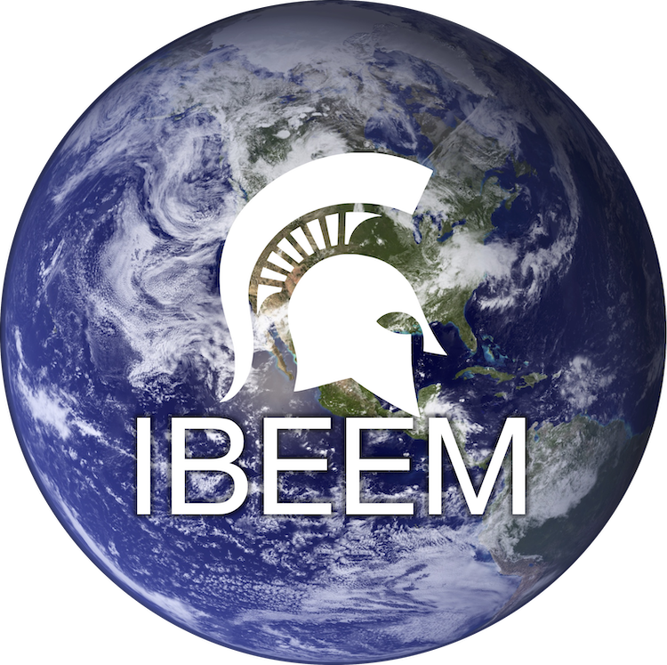

# Conclusions {#conclusions}

<center>

Thank you so much for attending our Collaborative Coding workshop! We hope that you learned something new that you will take with you into your research practice or share with others. 

Given that this is the first (but not the last!) time we plan to run this workshop, we are eagerly hoping for a lot of constructive criticism to help us improve for next time. In this vein, we would really appreciate it if you would fill out [***this short (5 question), anonymous survey***](https://docs.google.com/forms/d/e/1FAIpQLSf0093WX5C4qSedb7YIfOqVxPFbG8KpQQxpAJZiuyBGLj1rQA/viewform?usp=sf_link) before you leave today.


Thank you! 
</center> 

```{r ibeem, fig.align="center", echo=FALSE, out.width= "65%"} 


```

